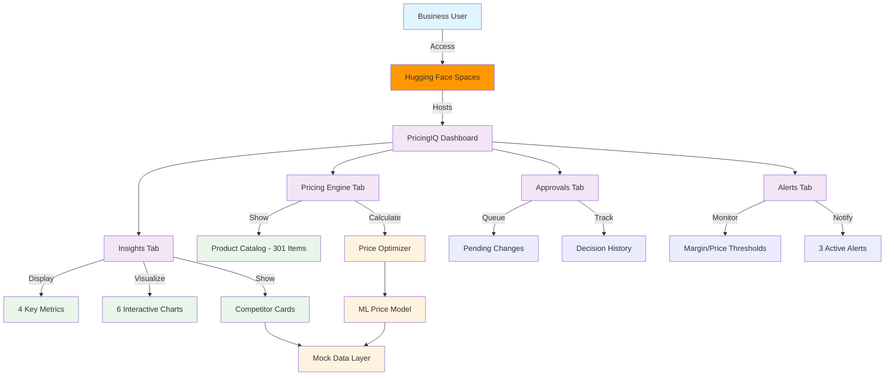
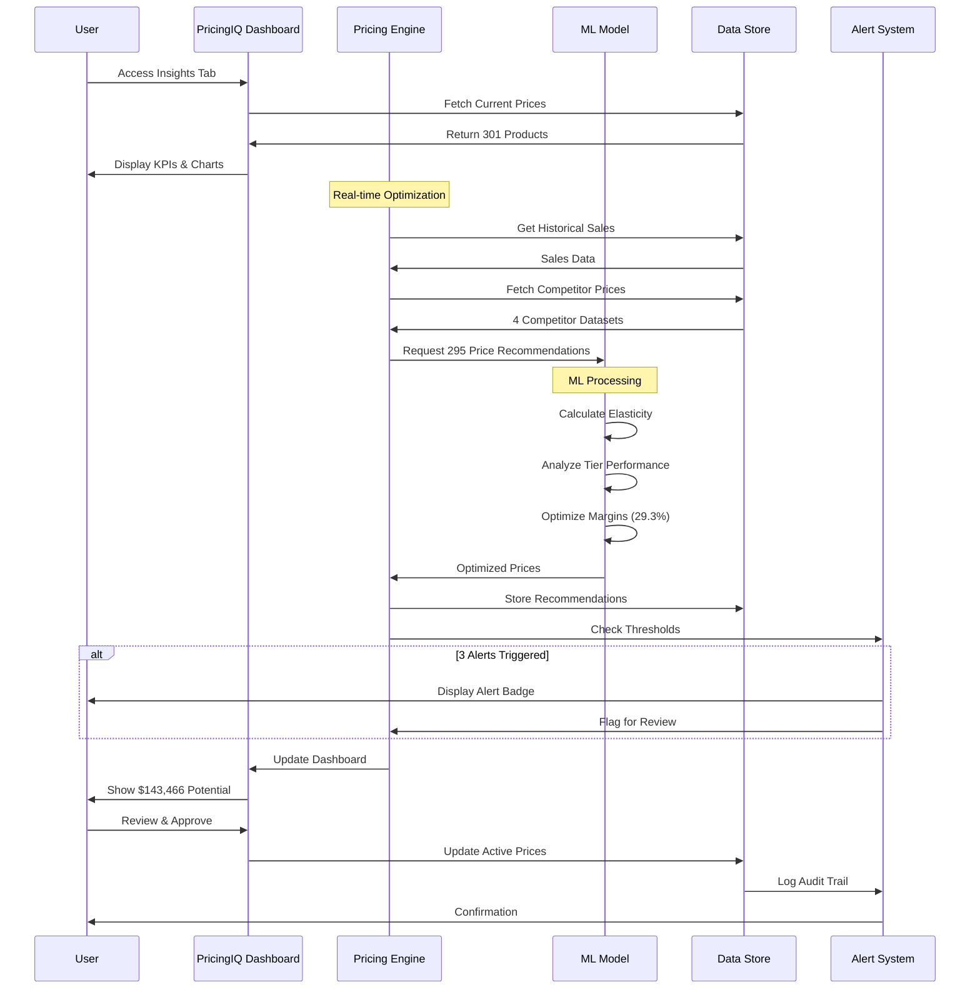
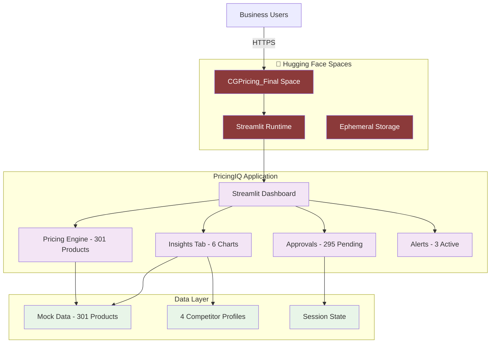

# PricingIQ: AI-Driven Dynamic Pricing Engine

An intelligent pricing optimization system powered by machine learning algorithms and real-time analytics that helps businesses maximize revenue and maintain market competitiveness through automated price recommendations, competitor monitoring, and executive insights.

## Features

- **Executive Insights Dashboard**
- **Revenue Impact Forecast**
- **Revenue by Category**
- **Price Change Distribution**
- **Performance by Tier**
- **Elasticity Trend Analysis**
- **Competitive Intelligence**
- **Smart Pricing Engine**
- **Approval Workflow**
- **Alert System**

  
## Tools Used

### Core Technologies
* **Python 3.11** - Backend logic and ML model implementation
* **Streamlit** - Interactive web application framework for rapid deployment
* **Plotly** - Interactive data visualizations and charts
* **Pandas & NumPy** - Data manipulation and numerical computing
* **Hugging Face Spaces** - Cloud deployment and hosting platform

### Machine Learning Stack (Ready for Integration)
* **XGBoost/LightGBM** - Gradient boosting for price elasticity modeling
* **Prophet** - Time series forecasting for demand prediction
* **Statistical Models** - Margin optimization and revenue forecasting


## System Architecture



## Complete Pricing Flow



## Deployment on Hugging Face Spaces



### Project Structure

```
CGPricing_Final/
├── app.py                    # Main PricingIQ application
├── requirements.txt          # Python dependencies
├── README.md                # Project documentation
├── tabs/
│   ├── insights.py          # Executive insights dashboard
│   ├── pricing_engine.py    # Pricing engine tab
│   ├── approvals.py         # Approvals workflow tab
│   ├── alerts.py            # Alert system tab
│   └── login.py             # Authentication module
├── data/
│   ├── mock_data.py         # Mock 301 products
│   ├── competitor_data.py   # 4 competitors data
│   └── elasticity_data.py   # Elasticity trends
├── utils/
│   ├── charts.py            # Plotly chart components
│   ├── kpi_cards.py         # KPI card widgets
│   └── helpers.py           # Helper functions
└── assets/
    └── logo.png             # PIQ logo
```
